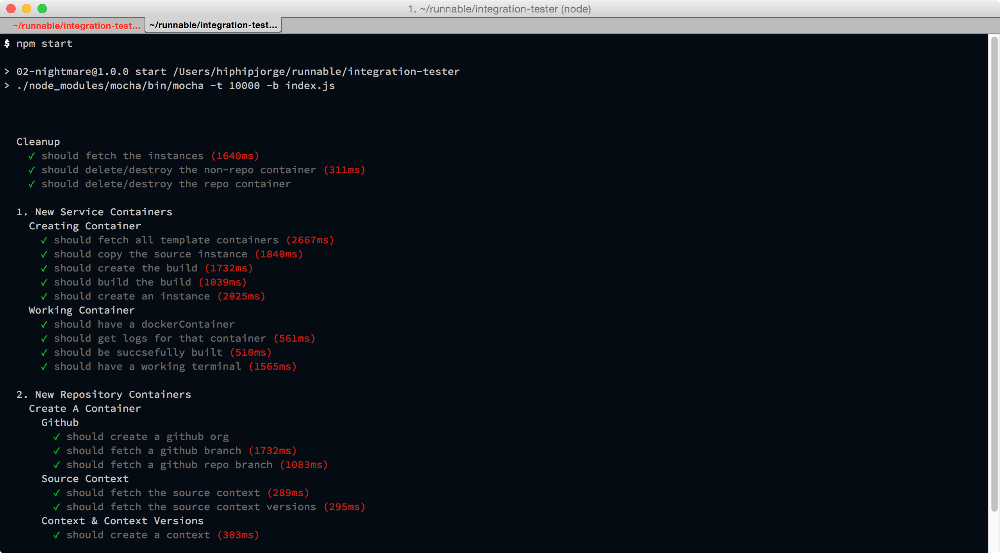

# SnoopALoop

*Integration Testing For API*

## Important To Know

- Two containers are created by default: `rethinkdb` and `hello-node-rethinkdb`
- `hello-node-rethinkdb` has a connection to the `rethinkdb` container
- A primus connection is used for connecting to build logs, CMD logs, and terminal
- Containers are deleted before the test is started
- Tests must be run **in order** and bail if any test fails

## Steps To Run

1. Push your branch to desired environment
2. Run `npm start`. If testing in another environment other than gamma, pass a `API_URL` env

